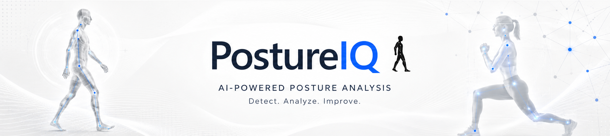
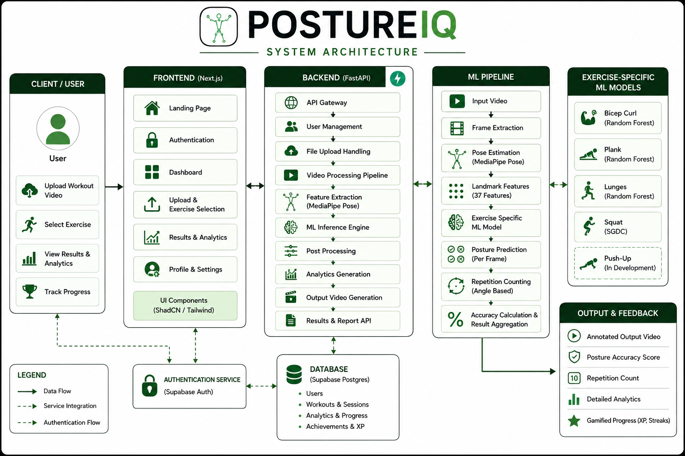
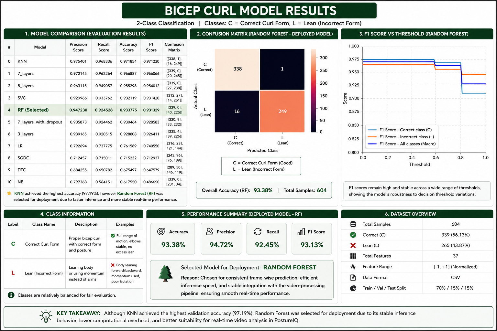
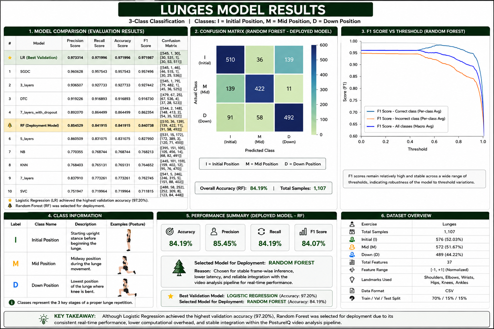
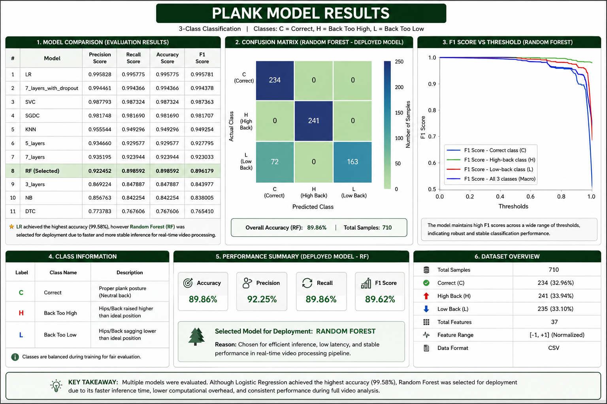
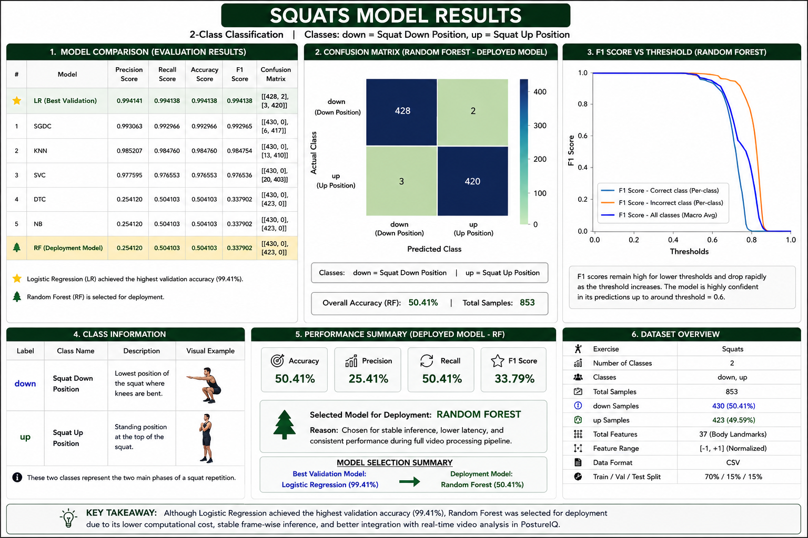
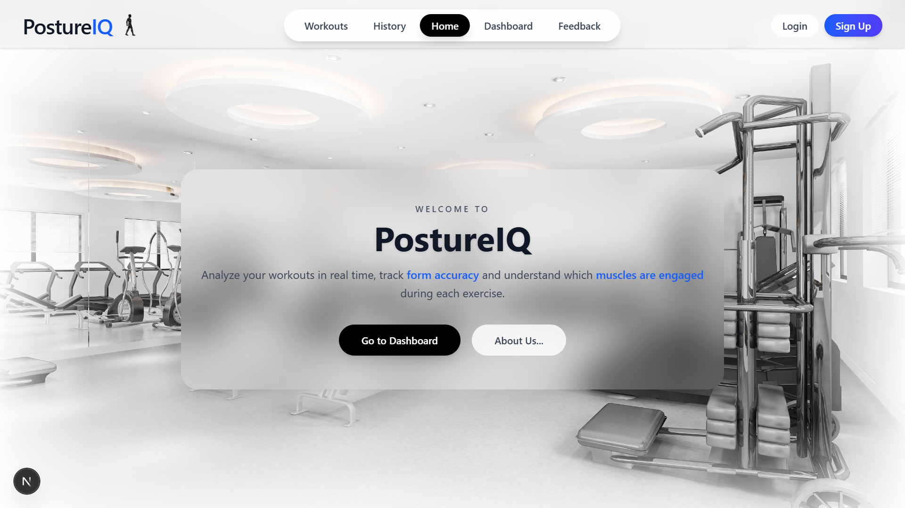
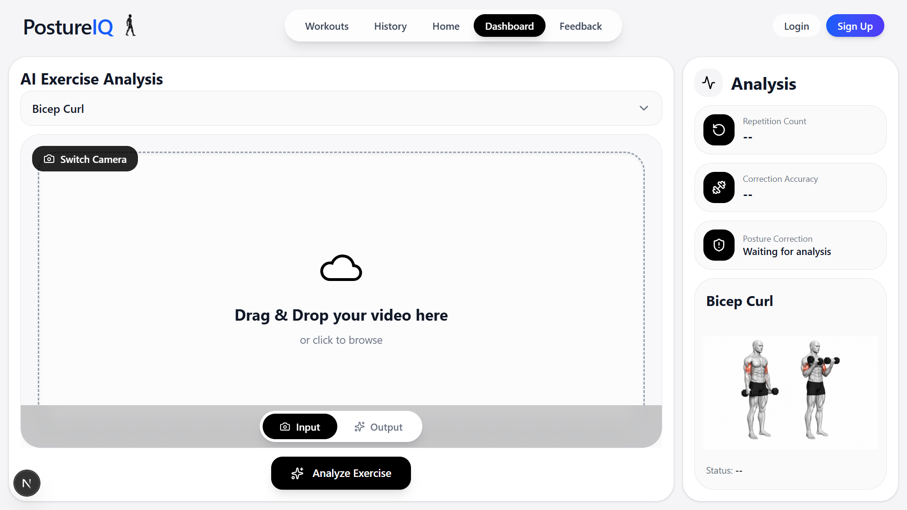
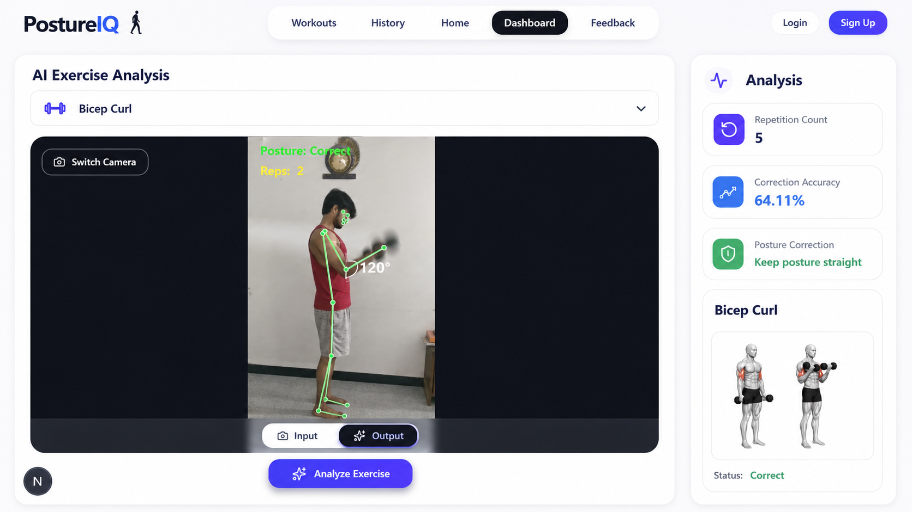

<p align="center">
  
</p>

<p align="center">
  
  
  
  
  
  
</p>

---

## 📌 Navigation

### Project

* [🚀 Overview](#-overview)
* [🌟 Project Highlights](#-project-highlights)
* [✨ Features](#-features)
* [🏗️ System Architecture](#️-system-architecture)
* [🔄 Workflow](#-end-to-end-workflow)
* [🏋️ Supported Exercises](#️-supported-exercises)
* [📊 Results](#-results)
* [📸 Screenshots](#-screenshots)

### Technical Documentation

* [🛠️ Technology Stack](#️-technology-stack)
* [📂 Repository Structure](#-repository-structure)
* [⚙️ Installation](#️-installation)
* [📖 Documentation](#-documentation)

### Team

* [👨‍💻 Development Team](#-development-team)
* [🚀 Future Scope](#-future-scope)

---

# 🚀 Overview

PostureIQ is an AI-powered fitness intelligence platform that evaluates exercise posture through Computer Vision and Machine Learning.

The platform analyzes uploaded workout videos, extracts pose landmarks using MediaPipe Pose, and performs exercise-specific posture assessment using trained machine learning models.

Unlike traditional fitness trackers that focus only on workout quantity, PostureIQ focuses on workout quality by helping users understand how well an exercise is being performed.

### Users Receive

* 📈 Posture Accuracy Score
* 🔁 Repetition Count
* 🎥 Annotated Output Videos
* 📊 Workout Analytics
* 🏆 XP Progression System
* 🔥 Workout Streak Tracking

<p align="right"><a href="#-navigation">⬆️ Back to Top</a></p>

---

# 🌟 Project Highlights

✅ Full-Stack AI Application

✅ Computer Vision Based Exercise Analysis

✅ Exercise-Specific Machine Learning Models

✅ Manual Dataset Creation & Annotation

✅ Pose Estimation Pipeline

✅ Automated Repetition Counting

✅ Video Annotation System

✅ User Dashboard & Analytics

✅ Gamification Features

✅ Production-Oriented Architecture

<p align="right"><a href="#-navigation">⬆️ Back to Top</a></p>

---

# ✨ Features

| Feature               | Description                     |
| --------------------- | ------------------------------- |
| 🎥 Video Upload       | Upload workout recordings       |
| 🧠 Pose Estimation    | MediaPipe Landmark Extraction   |
| 📏 Posture Evaluation | ML-Based Exercise Analysis      |
| 🔁 Rep Counting       | Angle-Based Repetition Tracking |
| 📊 Analytics          | Workout Performance Insights    |
| 🎯 Accuracy Score     | Frame-Level Evaluation          |
| 🎮 Gamification       | XP, Streaks, Achievements       |
| 📂 History Tracking   | Session Analysis Storage        |

<p align="right"><a href="#-navigation">⬆️ Back to Top</a></p>

---
# 🏗️ System Architecture

### High Level Architecture

```text
User
 │
 ▼
Frontend (Next.js)
 │
 │ Upload Video / Live Camera
 ▼
FastAPI Backend
 │
 ▼
MediaPipe Landmark Detection
 │
 ▼
Feature Extraction
 │
 ▼
Exercise-specific ML Models
 │
 ├── Bicep Curl Model
 ├── Squat Model
 ├── Plank Model
 └── Lunge Model
 │
 ▼
Prediction & Feedback Engine
 │
 ▼
Frontend Dashboard
```
<p align="right"><a href="#-navigation">⬆️ Back to Top</a></p>

---

# 🔄 End-to-End Workflow

```text
Upload Video
      │
      ▼
Frame Extraction
      │
      ▼
MediaPipe Pose
      │
      ▼
Feature Engineering
      │
      ▼
Machine Learning Inference
      │
      ▼
Posture Prediction
      │
      ▼
Rep Counting
      │
      ▼
Analytics Generation
      │
      ▼
Annotated Output Video
```

<p align="right"><a href="#-navigation">⬆️ Back to Top</a></p>

---

# 🏋️ Supported Exercises

| Exercise      | Model             |
| ------------- | ----------------- |
| 🦾 Bicep Curl | Random Forest     |
| 🦵 Squat      | SGDC              |
| 🚶 Lunges     | Random Forest     |
| 🧘 Plank      | Random Forest     |
| 💪 Push-Up    | Under Development |

<p align="right"><a href="#-navigation">⬆️ Back to Top</a></p>

---

# 📊 Results

| Exercise   | Selected Model | Accuracy |
| ---------- | -------------- | -------- |
| Bicep Curl | Random Forest  | 93.38%   |
| Plank      | Random Forest  | 89.86%   |
| Lunges     | Random Forest  | 84.19%   |
| Squat      | SGDC           | 99.30%   |

<details open>
<summary><b>🏋️ Exercise Analysis Results</b></summary>

<br>

<table>
<tr>
<td align="center">
<b>Bicep Curls</b><br>

</td>

<td align="center">
<b>Lunges</b><br>

</td>
</tr>

<tr>
<td align="center">
<b>Plank</b><br>

</td>

<td align="center">
<b>Squat</b><br>

</td>
</tr>
</table>

</details>

### Key Observation

The highest validation model was not always selected for deployment. Production models were chosen based on inference stability, frame-wise processing efficiency, and integration reliability.

<p align="right"><a href="#-navigation">⬆️ Back to Top</a></p>

---

# 📸 Screenshots

## Home Page



## Dashboard



## Output Video



<p align="right"><a href="#-navigation">⬆️ Back to Top</a></p>

---

# 🛠️ Technology Stack

## Frontend

* Next.js
* TypeScript
* TailwindCSS

## Backend

* FastAPI
* Uvicorn
* REST APIs

## Computer Vision

* MediaPipe Pose
* OpenCV

## Machine Learning

* Scikit-Learn
* NumPy
* Pandas
* Random Forest
* Logistic Regression
* KNN
* SGDC

## Database & Authentication

* Supabase

<p align="right"><a href="#-navigation">⬆️ Back to Top</a></p>

---
# 📂 Repository Structure

```text
PostureIQ/
│
├── 📁 Frontend/                     # Next.js + TypeScript UI
│   ├── app/
│   │   ├── components/             # Reusable UI components
│   │   │   ├── LiveCam/
│   │   │   ├── CameraFeed.tsx
│   │   │   ├── ExerciseSidebar.tsx
│   │   │   ├── OutputCanvas.tsx
│   │   │   └── ...
│   │   │
│   │   ├── context/                # Authentication state
│   │   │   └── AuthContext.tsx
│   │   │
│   │   ├── Dashboard/
│   │   ├── Login/
│   │   ├── Signup/
│   │   ├── Profile/
│   │   ├── History/
│   │   └── Workouts/
│   │
│   ├── public/                     # Static assets
│   └── package.json
│
├── 📁 Backend/                      # FastAPI Backend
│   ├── app/
│   │   ├── main.py                 # API entry point
│   │   │
│   │   ├── routers/
│   │   │   └── predict.py          # Prediction endpoints
│   │   │
│   │   ├── services/
│   │   │   └── video_processor.py  # MediaPipe + ML pipeline
│   │   │
│   │   ├── ml_models/
│   │   │   ├── bicep_model/
│   │   │   ├── squat_model/
│   │   │   ├── plank_model/
│   │   │   └── lunge_model/
│   │   │
│   │   ├── database/              # DB connection layer
│   │   ├── db_models/             # Database models
│   │   ├── schemas/               # API request/response schemas
│   │   ├── uploads/               # Uploaded videos
│   │   ├── outputs/               # Processed outputs
│   │   └── utils/                 # Helper functions
│   │
│   └── requirements.txt
│
├── 📁 Docs/
│   ├── Readme_Images/             # README assets
│   ├── SystemArchitecture.png
│   ├── FrontendArchitecture.png
│   ├── BackendArchitecture.png
│   └── PostureIQ.pdf
│
├── README.md
└── .gitignore
```

<p align="right"><a href="#-navigation">⬆️ Back to Top</a></p>

---

# ⚙️ Installation

### Clone Repository

```bash
git clone <repository-url>
cd PostureIQ
```

### Frontend

```bash
cd frontend
npm install
npm run dev
```

### Backend
make sure you have pyhton-3.10 is installed
```bash
cd backend
py-3.10 -m venv venv
venv/Scripts/activate
pip install -r requirements.txt
uvicorn main:app --reload
```

<p align="right"><a href="#-navigation">⬆️ Back to Top</a></p>

---

# 📖 Documentation

| Module              | Documentation             |
| ------------------- | ------------------------- |
| 🎨 Frontend         | frontend/README.md        |
| ⚙️ Backend          | backend/README.md         |
| 🧠 Machine Learning | ml/README.md              |
| 📄 Full Report      | docs/PostureIQ_Report.pdf |

<p align="right"><a href="#-navigation">⬆️ Back to Top</a></p>

---

# 👨‍💻 Development Team

## Mradul Bhartiya

Machine Learning • Computer Vision • Backend Development

## Moksh Kasture

Frontend Development • UI/UX • Dashboard Engineering

<p align="right"><a href="#-navigation">⬆️ Back to Top</a></p>

---

# 🚀 Future Scope

* Real-Time Webcam Analysis
* Live Posture Correction
* Automatic Exercise Detection
* Mobile Application
* Personalized Workout Recommendations
* Cloud-Based Analytics Infrastructure
* AI Fitness Coach
* Injury Risk Prediction

---

⭐ If you found this project interesting, consider starring the repository.

Built with ❤️ using Computer Vision, Machine Learning, FastAPI, and Next.js.
